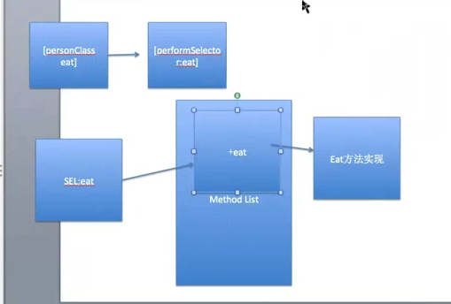
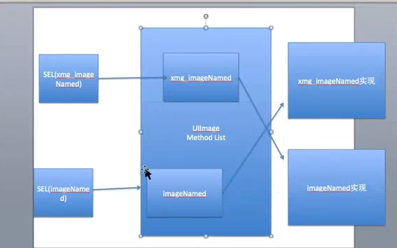

注意：

```
1、__kindof:表示当前类或者它子类

例如：
	// __kindof Person *：表示可以是Person类或者它的子类
	+ (__kindof Person *)Person;
	
	// 仅仅表示是Person类
	+ (Person *)Person;

2、id不能在编译的时候检查真实类型；返回值没有提示

3、instance会自动识别当前对象的类
```

####一、runtime的消息机制

```objc
@interface Person : NSObject
- (void)eat;
+ (void)eat;

- (void)run:(int)age;
@end

@implementation Person

+ (void)eat
{
    NSLog(@"类方法eat");
}

- (void)eat
{
    NSLog(@"对象方法eat");
}

- (void)run:(int)age
{
    NSLog(@"对象方法run:%d",age);
}

@end
```

```objc
Person *p = [[Person alloc] init];
```
<strong>1、操作步骤：</strong>

1.1、使用运行时的第一步:导入<objc/message.h>

1.2、第二步:**Build Setting** -> 搜索**msg**

<strong>2、消息机制：任何方法调用，本质都是发送消息</strong>

2.1、OC : 运行时机制，消息机制是运行时机制最重要的机制

2.2、**SEL**:方法编号，根据方法编号就可以找到对应方法实现

```objc
[p performSelector:@selector(eat)];
```

2.3、运行时，发送消息，谁做事情就那谁

```objc
objc_msgSend(p, @selector(eat));

objc_msgSend(p, @selector(run:),10);
```

2.4、类方法调用

- 类名调用类方法，本质类名转换成类对象

```objc
[Person eat];
// 调用体系
// 获取类对象
 Class personClass = [Person class];
 
 [personClass performSelector:@selector(eat)];
 
 // 运行时
objc_msgSend(personClass, @selector(eat));
```
- 看图



####二、runtime的交换方法

```objc
@implementation ViewController
- (void)viewDidLoad {
    [super viewDidLoad];
	//  UIImage *image = [UIImage imageNamed:@"123"];
    // imageNamed加载图片,并不知道图片是否加载成功
    // 以后调用imageNamed的时候，就知道图片是否加载
    
    // 1.每次使用，都需要导入头文件
    // 2.当一个项目开发太久，使用这个方式不靠谱
    UIImage *image = [UIImage zx_imageNamed:@"123"];
    
    // imageNamed:
    // 1.实现方法:底层调用zx_imageNamed
    // 2.本质:交换两个方法的实现imageNamed和zx_imageNamed方法
    
    UIImage *image1 = [UIImage imageNamed:@"123"];
}
@end

@interface UIImage (ZXImage)

+ (__kindof UIImage *)zx_imageNamed:(NSString *)imageName;

@end

@implementation UIImage (ZXImage)

// 加载这个分类的时候调用
+ (void)load
{
    // class_getMethodImplementation: 获取方法实现
    // class_getInstanceMethod: 获取对象方法
    // class_getClassMethod: 获取类方法
    // IMP:方法实现
    
    // imageNamed
    // Class:获取哪个类的方法
    // SEL:获取方法编号，根据SEL就能去对应的类找方法
    Method imageNameMethod = class_getClassMethod([UIImage class], @selector(imageNamed:));

    // zx_imageNamed
    Method zx_imageNamed = class_getClassMethod([UIImage class], @selector(zx_imageNamed:));
    
    // 交换方法实现
    method_exchangeImplementations(imageNameMethod, zx_imageNamed);
}
// 运行时

// 先写一个方法

// 在分类里面不能调用super，分类没有父类
//+ (UIImage *)imageNamed:(NSString *)name
//{
//    [super ];
//}

+ (__kindof UIImage *)zx_imageNamed:(NSString *)imageName
{
    // 1.加载图片
    UIImage *image = [UIImage zx_imageNamed:imageName];
    
    // 2.判断功能
    if(image == nil)
    {
        NSLog(@"image为空");
    }
    
    return image;
}

@end

```
**如图:**


####三、Runtime动态添加方法
- 开发使用场景：如果一个类方法非常多，加载类到内存的时候也比较耗费资源，需要给每个方法生成映射表，可以使用动态给某个类，添加方法解决。

- 经典面试题: 有没有使用performSelector，其实主要问你有没有动态添加过方法。
- 简单使用

```objc
@implementation ViewController
- (void)viewDidLoad {
    [super viewDidLoad];
 // performSelector:动态添加方法
    Person *p = [[Person alloc] init];
    
    // 动态添加方法
    [p performSelector:@selector(eat)];
    
    // 动态添加方法带参数的
    [p performSelector:@selector(run:) withObject:@20];
}
@end

@interface Person : NSObject

@end

@implementation Person


// 默认一个方法都有两个参数，self，_cmd,隐式参数
// self:方法调用者
// _cmd:调用方法的编号

// 动态添加方法，首先实现这个方法resolveInstanceMethod
// resolveInstanceMethod调用：当调用了一个方法没有实现的方法的时候，就会调用resolveInstanceMethod
// resolveInstanceMethod作用: 就知道哪些方法没有实现，从而动态添加方法
// sel: 就是没有实现的那个方法
+ (BOOL)resolveInstanceMethod:(SEL)sel
{
    // 动态添加eat方法
    if(sel == @selector(eat))
    {
        /**
         *  cls:给哪个类添加方法
         *  SEL:添加方法的方法编号是什么
         *  IMP:方法实现，函数入口，函数名
         *  types:方法类型
         */
        class_addMethod(self, @selector(eat), (IMP)eat, "v@:");
        
        // 处理完
        return YES;
    }else if(sel == @selector(run:))
    {
        // @:对象   :方法编号(SEL)
        class_addMethod(self, @selector(run:), (IMP)run, "v@:@");
    }
    return [super resolveInstanceMethod:sel];
}

// 定义函数
// 没有返回值，参数(id,SEL)为隐式参数
// void(id,SEL)
void eat(id self, SEL _cmd)
{
    NSLog(@"调用eat %@ %@",self,NSStringFromSelector(_cmd));
}

void run(id self,SEL _cmd, id params)
{
    NSLog(@"调用run: %@ %@ %@",self,NSStringFromSelector(_cmd),params);
}
@end

```

####四、给分类添加属性
- 原理：给一个类声明属性，其实本质就是给这个类添加关联，并不是直接把这个值的内存空间添加到类存空间。
- 简单实用：

```objc
@implementation ViewController
- (void)viewDidLoad {
    [super viewDidLoad];
   NSObject *objc = [[NSObject alloc] init];
    objc.name = @"12314";
}
@end

// 在分类里面@property只会产生get和set方法的声明，他的实现是不会有的
@interface NSObject (Objc)

@property (nonatomic,copy)NSString *name;

@end

@implementation NSObject (Objc)

// 自己实现set跟get方法
- (void)setName:(NSString *)name
{
    // 添加属性，跟对象
    // 给某个对象产生关联，添加属性
    // object: 给哪个对象添加属性
    // key:属性名，根据key去获取关联的对象
    // value: 关联的值
    // policy: 策越
    objc_setAssociatedObject(self, @"name", name, OBJC_ASSOCIATION_COPY_NONATOMIC);
}

- (NSString *)name
{
    return objc_getAssociatedObject(self, @"name");
}

@end
```

####五、自动生成模型属性代码
- 简单使用

```objc
@implementation ViewController

- (void)viewDidLoad {
    [super viewDidLoad];
 // 解析plist
    NSString *filePath = [[NSBundle mainBundle] pathForResource:@"status.plist" ofType:nil];
    NSDictionary *dict = [NSDictionary dictionaryWithContentsOfFile:filePath];
    NSArray *dictArr = dict[@"statuses"];
    
    [NSObject createPropertyCodeWithDict:dictArr[0]];
    }
@end

@interface NSObject (Property)

+ (void)createPropertyCodeWithDict:(NSDictionary *)dict;

@end

@implementation NSObject (Property)

+ (void)createPropertyCodeWithDict:(NSDictionary *)dict
{
    NSMutableString *strM = [NSMutableString string];
    
    // 遍历字典
    [dict enumerateKeysAndObjectsUsingBlock:^(id  _Nonnull propertyName, id  _Nonnull value, BOOL * _Nonnull stop) {
        //        NSLog(@"%@ %@",propertyName,[value class]);
        NSString *code;
        if ([value isKindOfClass:NSClassFromString(@"__NSCFString")]) {
            code = [NSString stringWithFormat:@"@property (nonatomic, strong) NSString *%@;",propertyName]
            ;
        }else if ([value isKindOfClass:NSClassFromString(@"__NSCFNumber")]){
            code = [NSString stringWithFormat:@"@property (nonatomic, assign) int %@;",propertyName]
            ;
        }else if ([value isKindOfClass:NSClassFromString(@"__NSCFArray")]){
            code = [NSString stringWithFormat:@"@property (nonatomic, strong) NSArray *%@;",propertyName]
            ;
        }else if ([value isKindOfClass:NSClassFromString(@"__NSCFDictionary")]){
            code = [NSString stringWithFormat:@"@property (nonatomic, strong) NSDictionary *%@;",propertyName]
            ;
        }
        [strM appendFormat:@"\n%@\n",code];
 
    }];
    
    NSLog(@"%@",strM);
}
```

####六、KVC报错处理、KVC
- 比如当一个字典中有id这样的key时，或者识别不了的key值，可做如下操作

```objc
@implementation ViewController

- (void)viewDidLoad {
    [super viewDidLoad];
    // 解析plist
    NSString *filePath = [[NSBundle mainBundle] pathForResource:@"status.plist" ofType:nil];
    NSDictionary *dict = [NSDictionary dictionaryWithContentsOfFile:filePath];
    NSArray *dictArr = dict[@"statuses"];
    
    [NSObject createPropertyCodeWithDict:dictArr[0]];
    
    NSMutableArray *dataArr = [NSMutableArray array];
    for(NSDictionary *dict in dictArr)
    {
        // 字典转模型
        Status *s = [Status statusWithDict:dict];
        [dataArr addObject:s];
    }
}
@end

@interface Status : NSObject

@property (nonatomic, assign) NSInteger ID;

@property (nonatomic, strong) NSString *source;

@property (nonatomic, assign) int reposts_count;

@property (nonatomic, strong) NSArray *pic_urls;

@property (nonatomic, strong) NSString *created_at;

@property (nonatomic, assign) int attitudes_count;

@property (nonatomic, strong) NSString *idstr;

@property (nonatomic, strong) NSString *text;

@property (nonatomic, assign) int comments_count;

@property (nonatomic, strong) NSDictionary *user;

+ (__kindof Status *)statusWithDict:(NSDictionary *)dict;

@end

@implementation Status

+ (Status *)statusWithDict:(NSDictionary *)dict
{
    Status *status = [[Status alloc] init];
    
    // KVC
    [status setValuesForKeysWithDictionary:dict];
    
    return status;
}

// 解决KVC报错，比如：模型中有个key为id
- (void)setValue:(id)value forUndefinedKey:(nonnull NSString *)key
{
    if ([key isEqualToString:@"id"]) {
        _ID = [value integerValue];
    }
    // key:没有找到key
    // value:没有找到key对应的值
    NSLog(@"%@ %@",key,value);

}
@end

```

####七、runtime:遍历模型中所有属性名,去字典中查找
- 简单使用

```objc
@implementation ViewController

/**
 *  KVC : 遍历字典中所有key,去模型中查找有没有对应的属性名
 *  runtime : 遍历模型中所有属性名,去字典中查找
 */
- (void)viewDidLoad {
    [super viewDidLoad];
    // 解析plist
    NSString *filePath = [[NSBundle mainBundle] pathForResource:@"status.plist" ofType:nil];
    NSDictionary *dict = [NSDictionary dictionaryWithContentsOfFile:filePath];
    NSArray *dictArr = dict[@"statuses"];
    
    [NSObject createPropertyCodeWithDict:dictArr[0]];
    
    NSMutableArray *dataArr = [NSMutableArray array];
    for(NSDictionary *dict in dictArr)
    {
        // 字典转模型
        Status *s = [Status modelWithDict:dict];
        [dataArr addObject:s];
    }
    NSLog(@"%@",dataArr);
}
@end

@interface NSObject (Model)

+ (instancetype)modelWithDict:(NSDictionary *)dict;

@end

/*
 Ivar ivar1;
 Ivar ivar2;
 Ivar ivar3;
 Ivar a[] = {ivar3,ivar1,ivar2};
 Ivar *ivar = &a;

 */
@implementation NSObject (Model)
+ (instancetype)modelWithDict:(NSDictionary *)dict{
    
    // 1.创建对应类的对象
    id objc = [[self alloc] init];
    
    // runtime:遍历模型中所有成员属性,去字典中查找
    // 属性定义在哪,定义在类,类里面有个属性列表(数组)
    
    // 遍历模型所有成员属性
    // ivar:成员属性
    // class_copyIvarList:把成员属性列表复制一份给你
    // Ivar *:指向Ivar指针
    // Ivar *:指向一个成员变量数组
    // class:获取哪个类的成员属性列表
    // count:成员属性总数
    unsigned int count = 0;
    Ivar *ivarList = class_copyIvarList(self, &count);
    for (int i = 0 ; i < count; i++) {
        // 获取成员属性
        Ivar ivar = ivarList[i];
        
        // 获取成员名
       NSString *propertyName = [NSString stringWithUTF8String:ivar_getName(ivar)];
        ;
        

        // 获取key
        NSString *key = [propertyName substringFromIndex:1];
        
        // user value:字典
        // 获取字典的value
        id value = dict[key];
        // 给模型的属性赋值
        // value:字典的值
        // key:属性名
        
        // 成员属性类型
        NSString *propertyType = [NSString stringWithUTF8String:ivar_getTypeEncoding(ivar)];
        // user:NSDictionary
        // 二级转换
        // 值是字典,成员属性的类型不是字典,才需要转换成模型
        if ([value isKindOfClass:[NSDictionary class]] && ![propertyType containsString:@"NS"]) { // 需要字典转换成模型
            // 转换成哪个类型
            
            // @"@\"User\"" User
            NSRange range = [propertyType rangeOfString:@"\""];
            propertyType = [propertyType substringFromIndex:range.location + range.length];
            // User\"";
            range = [propertyType rangeOfString:@"\""];
            propertyType = [propertyType substringToIndex:range.location];
            
            // 字符串截取
            
            // 获取需要转换类的类对象
        
           Class modelClass =  NSClassFromString(propertyType);
        
            if (modelClass) {
                value =  [modelClass modelWithDict:value];
                
            }
        }
        
        if (value) {
            // KVC赋值:不能传空
            [objc setValue:value forKey:key];
            
        }

    }
    return objc;
}
@end

```